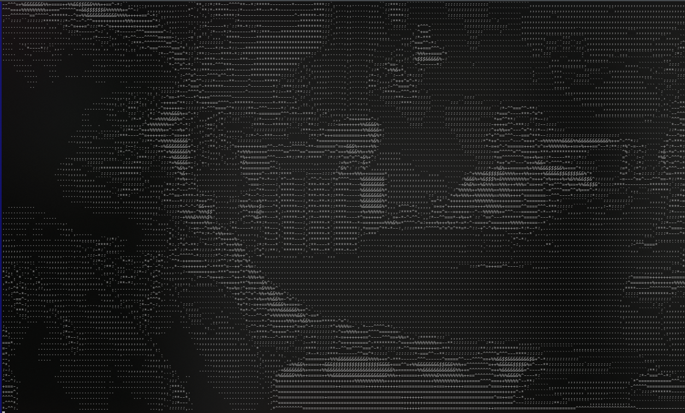

<div align="center" style="text-align:center">
 <h2>ASCII Player</h2>
 </div>


## Co to jest?
Aplikacja służy do odtwarzania plików wideo w emulatorze terminala w postaci ASCII art. Każda klatka filmu jest obrabiana w czasie rzeczywistym w celu przetworzenia je na "Obraz" widoczny w konsoli. Użytkownik będzie mógł zdefiniować przeskalowanie obrazu, ilość dostępnych znaków (lub własny zestaw znaków). 

## Jak to działa

Działanie programu jest podzielone na dwie części (tej npisanej w pythonie i tej napisanej w C). W pythonie z pomocą biblioteki ``` MoviePy ``` i ``` PyGame ``` oddzielana jest ścieżka dźwiękowa i pobierane są pojedyńcze klatki z filmu. Klatki są przesyłane do modułu napisanego w C. Tam obraz w postaci listy wartości RGB pojedyńczych pikseli przeliczany jest na wartość luminancji każdego piksela. Powstały obraz jest skalowany przez uśrednienie luminancji otaczających pikseli (promień w jakim są uśredniane piksele jest określany przy uruchomieniu programu) i zapisanie ich w postaci pojedyńczego piksela. Na końcu wartości są mapowane na zdefiniowany zestaw znaków. 

## Moduły

Moduły są pisane w języku C z wykorzystaniem biblioteki ``` Python.h ``` dostarczanej razem z interpreterem. Pozwala ona na integrację języka C i Pythona (m.in. pozwalając na przesłanie argumentów z poziomu słabotypowanego Pythona na silnietypowany C).

## Użycie

Moduł potrzebny do działania tego programu na ten momnet został skompilowany pod wersję pythona 3.10 i tylko pod tą działa. Jeżeli chcesz ją uruchomić na innej wersji należy moduł zrekompilować poleceniem 
```bash
    make
```
 Przed uruchomieniem należy zainstalować odpowiednie paczki pythona poleceniem:
```bash
    pip3 install opencv-python pygame moviepy numpy
```
Jeśli to nie działa trzeba stworzyć środowisko witrtualne pythona i tam zainstalować paczki.

Uruchomienie ogranicza się do polecenia
-
```bash
    python3.11 player.py -P [plik.mp4] -W [Szerokość] -H [Wysokość]
```
lub
```bash
    python3 player.py -P [plik.mp4] -W [Szerokość] -H [Wysokość]
```

Gdzie [Szerokość] i [Wysokość] są wielkościami w pikselach


<div align="center" style="text-align:center">
  <picture>
    <source media="(prefers-color-scheme: dark)" srcset="images/Toto-Africa.png">
    <source media="(prefers-color-scheme: light)" srcset="images/Toto-Africa.png">
    
  </picture>
  <h3>Przykładowy obraz przetworzony przez program</h3>
  </div>
